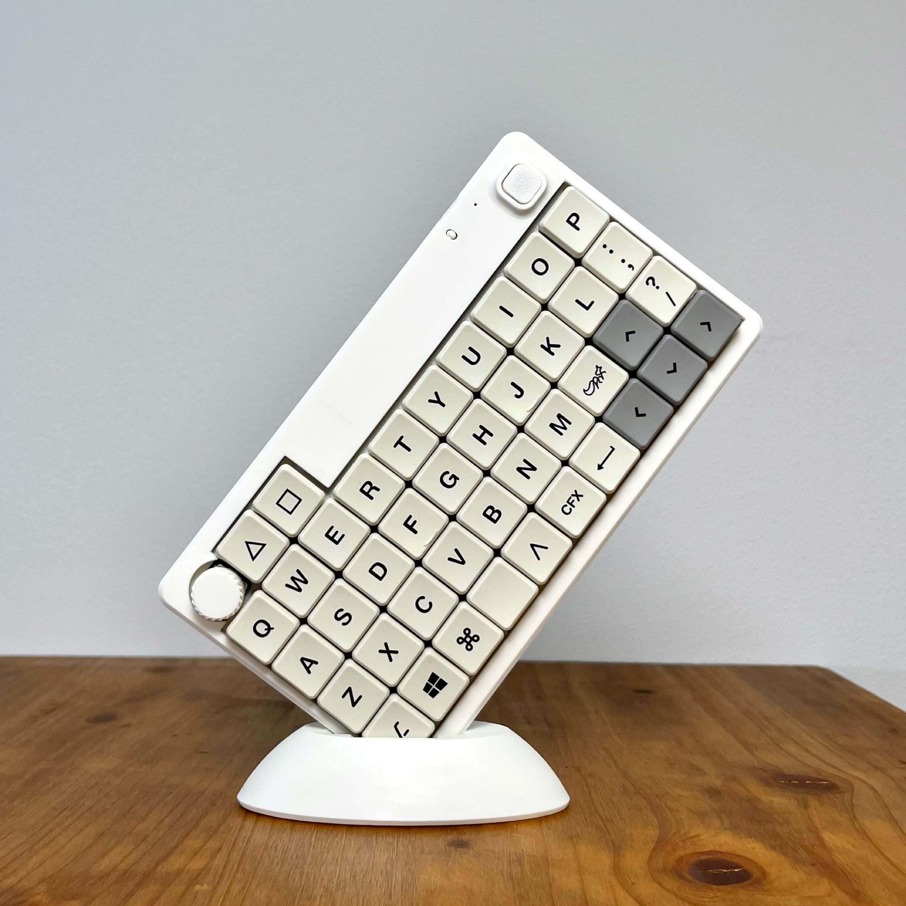
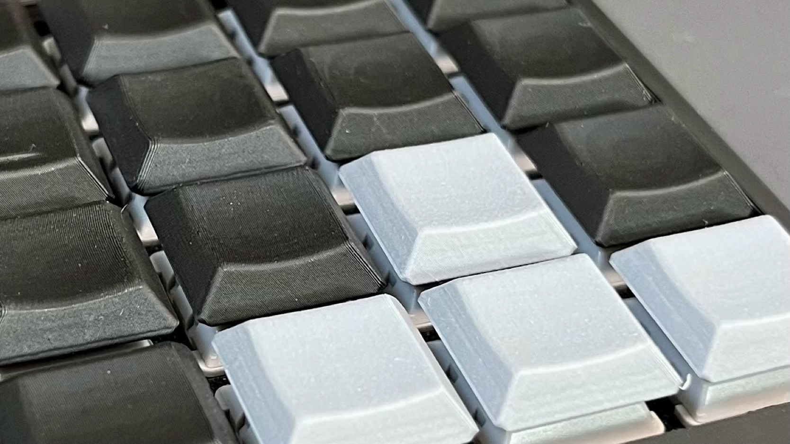
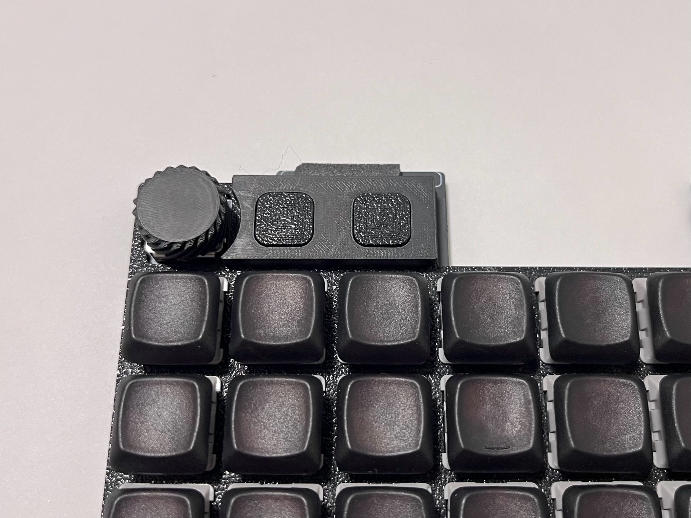

# Enigma_01 詳細説明

## 目次
1. [Enigma_01](#1-Enigma_01)  
2. [商品詳細](#2-商品詳細)  
  2-1. [商品内容](#2-1-商品内容)  
  2-2. [別途必要部品](#2-2別途必要部品)  
  2-3. [購入おすすめ品](#2-3-購入おすすめ品)  
  2-4. [3DP製キーキャップ](#2-4-3DP製キーキャップ)  
  2-5. [タクトスイッチキット](#2-5-タクトスイッチキット)  
3. [ビルドガイド](#3-ビルドガイド)  
  3-1. [ファームウェアについて](#3-1-ファームウェアについて)  
  3-2. [接続方法について](#3-2-接続方法について)  
  3-3. [部品取付について](#3-3-部品取付について)  
  3-4. [choc v1注意事項](#3-4-choc-v1キースイッチ注意事項)  
4. [注意事項](#4-注意事項)  

## 1. Enigma_01
Enigma_01は**17mm狭ピッチ40%キーボード**です。[40Plus](https://note.com/kazu_dob/n/n5ea06c3c5d62)([Kz](https://x.com/kazu_dob)さん)や[SPC_EVDR](https://github.com/weteor/SPC_EVDR)([weteor](https://github.com/weteor)さん)に影響を受けた背景があります。  

+ 販売は[BOOTH](https://nazuna293.booth.pm/items/7125433)で行っていきます。  
+ ユーザー向けのファームウェアは[こちら](https://github.com/nazuna293/zmk-Enigma_01-user-config)です。
+ 設計者向けのリポジトリも[公開](https://github.com/nazuna293/zmk-keyboard-Enigma_01)しています。

### 特徴
+ ZMK Firmwareによる無線接続対応
+ オーソリニア配列(42キー)
+ キーピッチ17mmの**狭ピッチ設計**
+ ロータリーエンコーダ搭載
+ [親指キー](docs/thumb_key.md)の**配列が選択可能**
+ リポバッテリー搭載可能

### 外観
寸法は(**W180×D100×H18mm​​​​​​​​​​​​​​​​​​​​​​**)で**iPad mini**にも収まります。
背面の傾斜（チルト）はありませんが、**ロープロ×狭ピッチ**により**違和感の少ない打鍵感**です。

### 初期キーマップ  

興味のある人はDiscordの[Enigma サポート開発](https://discord.gg/sYsCttWgKr)に立ち寄ってみてください。

## 2. 商品詳細
### 2-1. 商品内容
📷内容一覧  

|商品|数|備考|
|:-|:-|:-|
|Enigma_01本体|×1|[部品表](docs/parts_main.md)|
|[キーキャップ一式](#2-4-3DP製キーキャップ)|×1|[Nazuna_pick](https://nazuna293.booth.pm/items/7265342) 1.0u ×42 1.5u ×2 2.0u ×1|
|[タクトスイッチキット](#2-5-タクトスイッチキット)|×1|カスタム部品 [部品表](docs/parts_tact.md)|
|ディスプレイスタンド|×1|オマケ|
> Enigma_01本体は組み立て済みのため**はんだ付けは必要ありません**。  

> キーキャップは**狭ピッチ(17mm以下)対応のもの**が取り付け可能です。  

> リポバッテリーを搭載する場合は**別途購入、取付**する必要があります。  

### 2-2.別途必要部品
|商品|数|備考|
|:-|:-|:-|
|キースイッチ|×39~42|対応するスイッチ Choc v1、Choc v2(Kailh,Lofree)|
|USB-Cケーブル|×1|接続、充電用|
> 付属するキーキャップCherry MX軸で**Choc v2**に対応します。　　
#### 対応するスイッチ

### 2-3. 購入おすすめ品
#### 市販キーキャップ
17mm狭ピッチに対応した市販キーキャップをいくつか紹介します。
|商品|軸|取扱先|
|:-|:-|:-|
|junana mx|Cherry MX軸|[booth](https://decentkeyboards.booth.pm)|
|Kotori Blank(Proto)|Cherry MX軸|[booth](https://shakupan.booth.pm/items/6781056)|
|Chosfox|Choc v1軸|[遊舎工房](https://shop.yushakobo.jp/products/6143)|

#### リポバッテリー
無線接続の電源として本体に内蔵することが出来ます。
|商品|数|備考|
|:-|:-|:-|
||×1|[amazom](https://amzn.asia/d/9lPlnt1)|
> 取付方法、適合寸法などは[こちら](docs/battery.md)でご確認ください。

#### メンテナンス道具
|商品|数|備考|
|:-|:-|:-|
|プラスドライバー|×1|M2ネジ対応|
|キープラー|×1| |
> キーボードを分解するときに必要となります。  

### 2-4. 3DP製キーキャップ

オリジナルキーキャップ[Nazuna_pick](https://nazuna293.booth.pm/items/7265342)が付属します。狭ピッチ（17mm）のMX軸(Choc v2)で**誤タッチしづらい**ことに重点を置いた設計です。
> 積層が縦になるように取り付けることで手触りが良くなります。  

### 2-5. タクトスイッチキット

最上段の2キーをタクトスイッチに置き換えるためのキットです。取付方法は[こちら](docs/tact_sw.md)です。

## 3. ビルドガイド
1. Enigma_01を開封して商品内容を確認する
2. キースイッチとキーキャップを取り付ける
3. デバイスと接続して動作確認する

### 3-1. ファームウェアについて
ファームウェアやキーマップ編集は[こちら](https://github.com/nazuna293/zmk-Enigma_01-user-config)です。

### 3-2. 接続方法について
#### 有線接続の方法
1. デバイスとUSB-Cケーブルで接続する
2. 自動接続されるので動作確認する

#### 無線接続の方法
1. デバイスからEnigma_01を検出する
2. BT_SEL0でメインデバイスとペアリングする
> BT_SEL1~SEL4でサブデバイスとペアリングする  
> BT_CLR_ALL**でペアリング情報をクリアすることもできる  
### 3-3. 部品取付について
#### 親指キーの配列変更方法
詳細は[こちら](docs/thumb_key.md)です。

#### タクトスイッチキット取付方法
詳細は[こちら](docs/tact_sw.md)です。

#### リポバッテリー取付方法
詳細は[こちら](docs/battery.md)です。

### 3-4. Choc v1キースイッチ注意事項
利用可能なキー配列の制限やキースイッチが横向きになる箇所、ピンカットが必要な場合があります。詳細は[こちら](docs/choc_v1.md)です。

## 4. 搭載したカスタム機能（モジュール）

|:-|:-|
|[zmk-rgbled-widget]( https://github.com/caksoylar/zmk-rgbled-widget)|バッテリー残量や接続状況をLEDで表示|
|[zmk-layout-shift](https://github.com/kot149/zmk-layout-shift)|US配列とJIS配列のキーコード相違を解消|
|[zmk-listener](https://github.com/ssbb/zmk-listeners)|特定のキー操作を感知して指定した操作を実行|

バッテリー残量は🟩（30%↑）、🟨（10%↑）、🟥（0%↑）の3色で表示されます。

to_ALTレイヤーに居る間はALTキーが押された状態になります。推移と離脱を検知しています。

> tips
> [kot](https://x.com/kot149_)さんの[zmk-config-roBa](https://github.com/kot149/zmk-config-roBa)がとても参考になります。キーマップ関係の[ガイド](https://github.com/kot149/zmk-config-roBa/blob/main/docs/keymap.md)は必見です。

## 4. 注意事項
> [!CAUTION]
> リポバッテリーを搭載する場合は、適切に取り扱ってください。万が一、発煙などの異常が生じた場合には使用を中止してください。適切な取り扱いについては、[こちら](https://www.baj.or.jp/battery/safety/safety16.html)の参考情報をご覧ください。 
* 本製品は個人が趣味で設計したものであり、市販品と同等の品質や安全性は保証できません。また、本製品に関する違反指摘や自警行為はご遠慮ください。 
* 製品の組み立てや使用において発生した怪我や事故、その他の損害について、販売者は一切の責任を負いません。電子部品の取り扱いやハンダ付け作業は十分に注意して安全な環境で行ってください。
* 製品のケースとキーキャップは3Dプリント品です。積層痕や反りなどは3Dプリント品特有の仕上がりとしてご理解ください。
