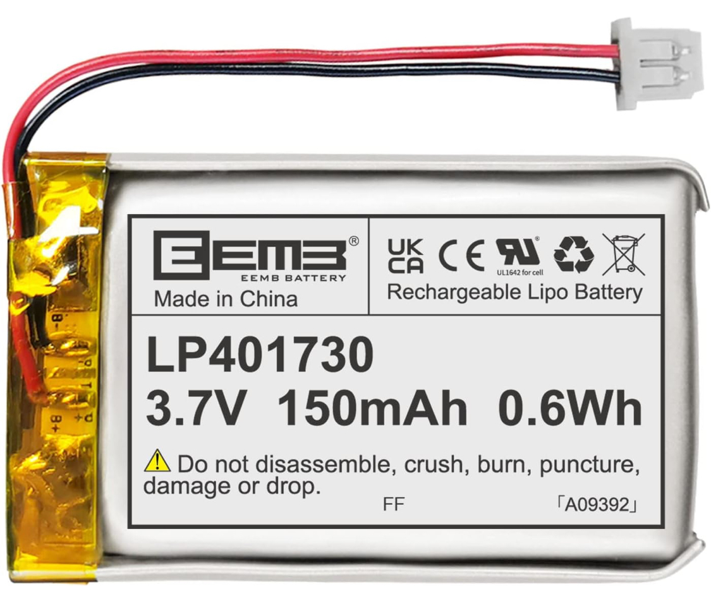

# リポバッテリー取付方法
3.7vリポバッテリーは安全のため保護回路付きで低容量のものをおすすめします。

## サイズ規格
サイズ:バッテリースペース(WDH)未満  
コネクタ:2ピン、1.25mmピッチ
劣化で膨らむ場合があるので、余裕を持って収まるサイズをおすすめします。

おすすめのサイズ規格は**401730**です。
私が使用しているリポバッテリーはこちらです。

## 取付方法