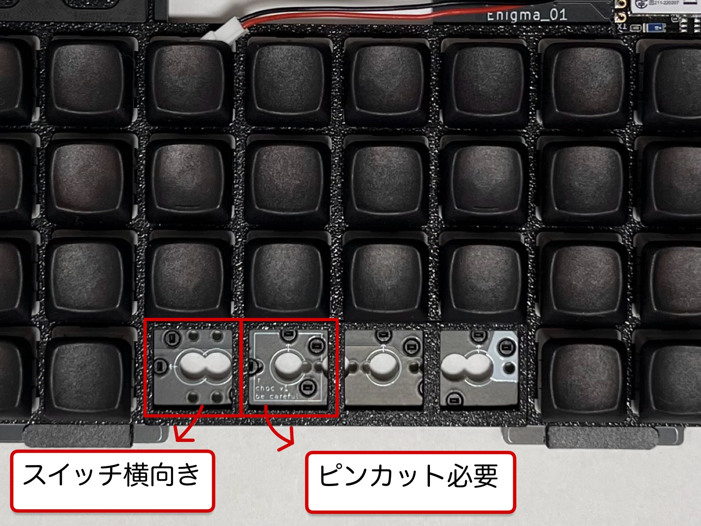

# choc v1 注意事項  
狭ピッチ×複数配列という設計上、choc v1キースイッチを使用する場合は、以下の注意点があります。  

## 1.0u配列のみ対応  
狭ピッチに対応した市販キーキャップは1.0uしか見当たりません。1.5u配列、2.0u配列を利用する場合はchoc v2キースイッチを使用してください。

## ピンカット
1.0u配列でchoc v1を使用する場合は、1箇所ピンカットする必要があります。
> PCBソケットを取り外すことでピンカットは不要なため事前にお申し付けください。  

## 取付向き
どの配列でも最下段左から5番目のスイッチを横向き(90°)に取り付けます。それに伴い**キーキャップの印字も横向き**になります。アルファベットが印字されたキーキャップを割り当てることには不向きですので注意してください。