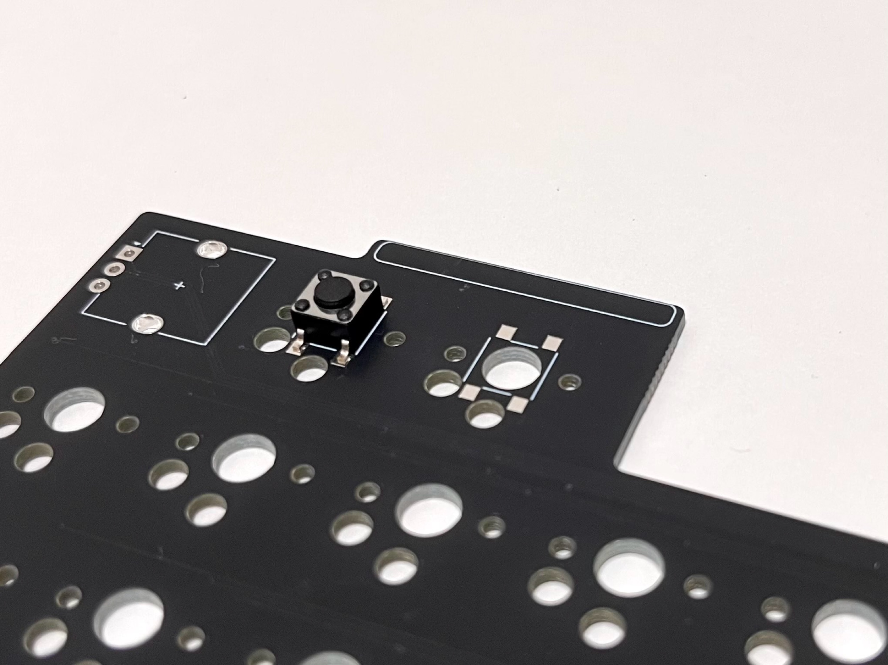

# タクトスイッチ取り付け
📷取付写真  
最上段2キーをタクトスイッチに置き換えて外観をカスタムすることができます。

## 必要なもの
・タクトスイッチキット  
・はんだごて

## 取付方法
1. 本体裏のネジ6本を外して、基板を取り出す。※ネジ、電源ボタンの紛失に注意。  
📷裏面
2. キースイッチ、トッププレートを取り外す。
3. タクトスイッチをはんだ付けする。  

> [!TIP]
> 縦長の向きに配置してください。上下の指定はありません。  
4. キースイッチ、トッププレートを取り付ける。
5. タクトスイッチカバーを取り付ける。※押し込むと嵌ります。  
📷取付方  
6. 基板をケースに戻して収まりを確認する。※電源ボタンをテープで留めておくのがコツ。  
7. 基板、USB-C、バッテリーの収まりを確認してネジ止めする。  

> タクトスイッチをテープで仮止めして、タクトスイッチカバーを取り付けても動作すると思います。