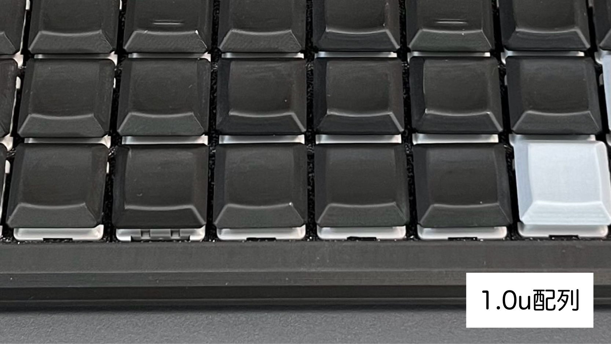
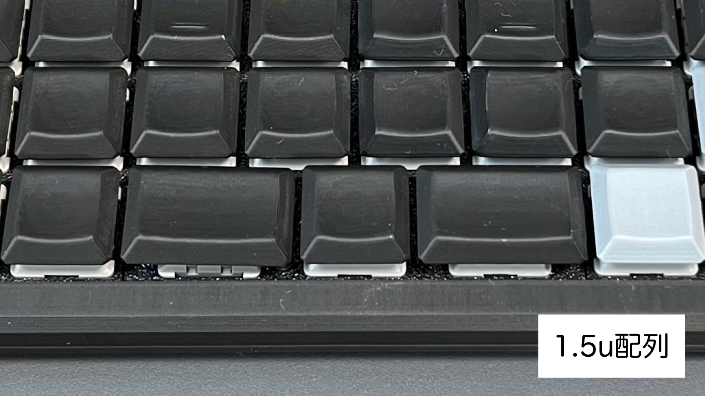
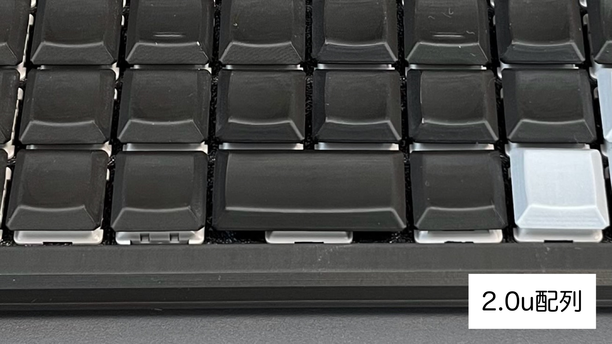
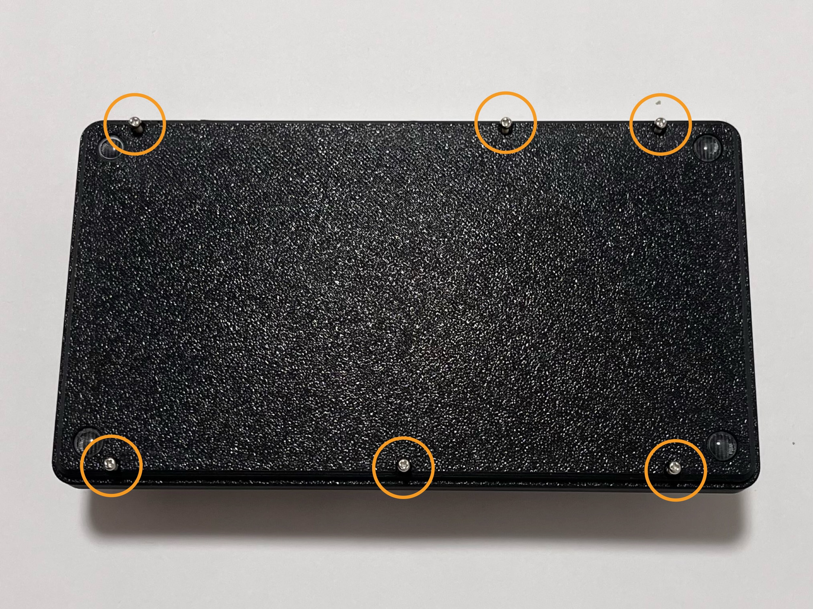
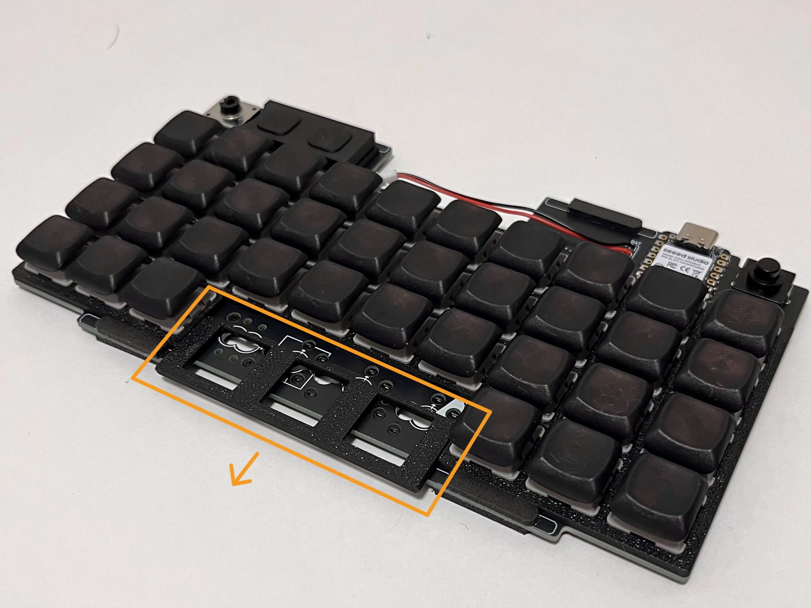

# 親指キーの配列
トッププレートを交換することで親指キー（最下段の中央4キー）の配列を変更することができます。

## 必要なもの
・親指キートッププレート  
・キープラー  
・プラスドライバー  

## 変更手順
1. 親指キーのキーキャップ、キースイッチを取り外す。
2. 本体裏のネジ6本を外して、基板を取り出す。※ネジ、電源ボタンの紛失に注意。  

3. 親指キーのトッププレートをスライドさせて交換する。  

4. 基板をケースに戻して収まりを確認する。※電源ボタンをテープで留めておくのがコツ。  
5. 基板、USB-C、バッテリーの収まりを確認してネジ止めする。  
6. 親指キーのキーキャップ、キースイッチを取り付ける。